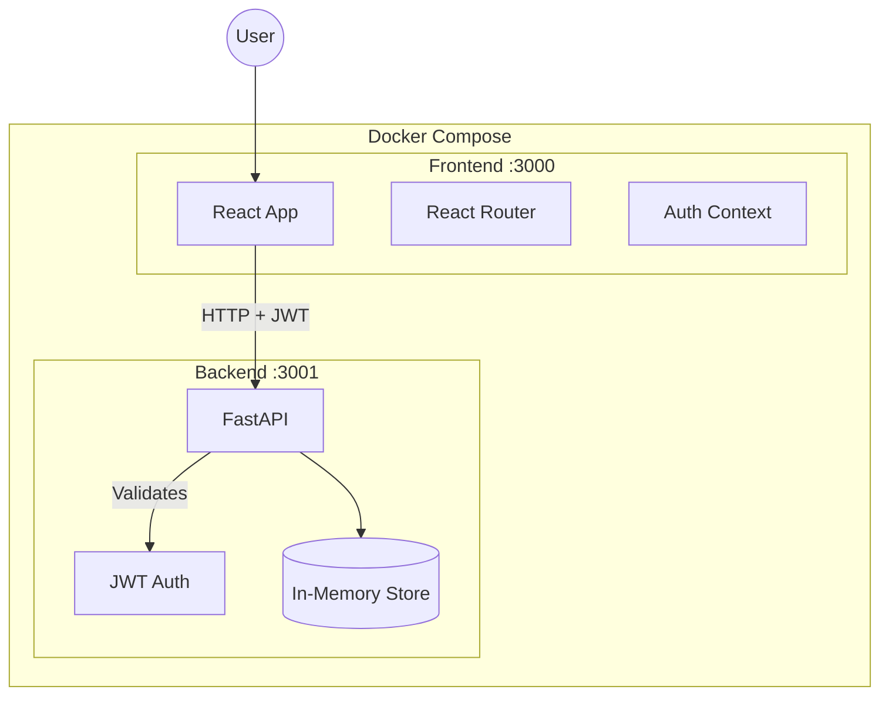
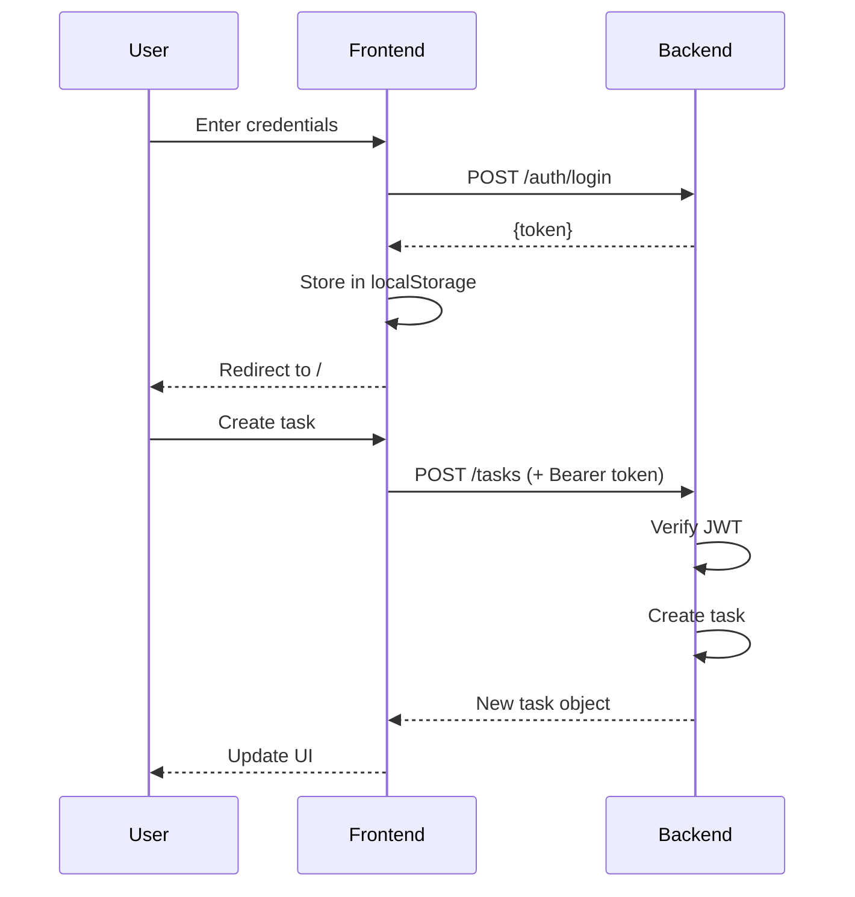

# Task Manager Architecture

> System architecture documentation with wireframes and data flow diagrams

---

## System Overview

```
┌─────────────────────────────────────────────────────────────────────────────┐
│                              DOCKER COMPOSE                                  │
│                                                                             │
│   ┌───────────────────────────────┐    ┌───────────────────────────────┐   │
│   │         FRONTEND              │    │          BACKEND              │   │
│   │      (React + TypeScript)     │    │         (FastAPI)             │   │
│   │                               │    │                               │   │
│   │   ┌─────────────────────┐    │    │   ┌─────────────────────┐    │   │
│   │   │    React Router     │    │    │   │    FastAPI App      │    │   │
│   │   │  ┌───────────────┐  │    │    │   │  ┌───────────────┐  │    │   │
│   │   │  │  /login       │  │    │    │   │  │  /auth/login  │  │    │   │
│   │   │  │  /            │  │────┼────┼───┼──│  /tasks       │  │    │   │
│   │   │  │  /tasks/:id   │  │ HTTP    │   │  │  /tasks/stats │  │    │   │
│   │   │  └───────────────┘  │ JSON    │   │  └───────────────┘  │    │   │
│   │   └─────────────────────┘    │    │   └──────────┬──────────┘    │   │
│   │                               │    │              │               │   │
│   │   ┌─────────────────────┐    │    │   ┌──────────▼──────────┐    │   │
│   │   │   Auth Context      │    │    │   │   In-Memory Store   │    │   │
│   │   │   (JWT Storage)     │    │    │   │   - tasks: Dict     │    │   │
│   │   └─────────────────────┘    │    │   │   - activities: Dict│    │   │
│   │                               │    │   └─────────────────────┘    │   │
│   │   Port: 3000                  │    │   Port: 3001                 │   │
│   └───────────────────────────────┘    └───────────────────────────────┘   │
│                                                                             │
└─────────────────────────────────────────────────────────────────────────────┘
```

---

## Component Architecture

### Frontend Components

```
┌──────────────────────────────────────────────────────────────┐
│                         App.tsx                               │
│                    (Router + AuthProvider)                    │
└────────────────────────────┬─────────────────────────────────┘
                             │
         ┌───────────────────┼───────────────────┐
         │                   │                   │
         ▼                   ▼                   ▼
┌─────────────────┐ ┌─────────────────┐ ┌─────────────────┐
│   LoginPage     │ │  TaskListPage   │ │ TaskDetailPage  │
│                 │ │                 │ │                 │
│ • Email input   │ │ • StatsCard     │ │ • Title editor  │
│ • Password      │ │ • Add task form │ │ • Status toggle │
│ • Error display │ │ • Task items    │ │ • Delete button │
│ • Submit button │ │ • Pagination    │ │ • Activity log  │
└─────────────────┘ └────────┬────────┘ └─────────────────┘
                             │
                    ┌────────▼────────┐
                    │   StatsCard     │
                    │                 │
                    │ Total|Done|Pend │
                    └─────────────────┘
```

### Backend Structure

```
┌─────────────────────────────────────────────────────────────┐
│                        main.py                               │
│                    (FastAPI Application)                     │
├─────────────────────────────────────────────────────────────┤
│  Middleware                                                  │
│  ├── CORS (allow localhost:3000)                            │
│  └── HTTPBearer (JWT validation)                            │
├─────────────────────────────────────────────────────────────┤
│  Routes                                                      │
│  ├── POST /auth/login      → create_token()                 │
│  ├── GET  /tasks           → list(tasks.values())           │
│  ├── POST /tasks           → tasks[id] = new_task           │
│  ├── GET  /tasks/stats     → aggregate counts               │
│  ├── GET  /tasks/{id}      → tasks[id]                      │
│  ├── PUT  /tasks/{id}      → update title                   │
│  ├── PUT  /tasks/{id}/complete → toggle + log               │
│  ├── DELETE /tasks/{id}    → del tasks[id]                  │
│  └── GET  /tasks/{id}/activity → activities[id]             │
├─────────────────────────────────────────────────────────────┤
│  Dependencies                                                │
│  ├── models.py   (Pydantic schemas)                         │
│  └── auth.py     (JWT create/verify)                        │
└─────────────────────────────────────────────────────────────┘
```

---

## Data Flow Diagrams

### Authentication Flow

```
┌────────┐                    ┌────────┐                    ┌────────┐
│  User  │                    │Frontend│                    │Backend │
└───┬────┘                    └───┬────┘                    └───┬────┘
    │                             │                             │
    │  1. Enter credentials       │                             │
    │─────────────────────────────>                             │
    │                             │                             │
    │                             │  2. POST /auth/login        │
    │                             │  {email, password}          │
    │                             │─────────────────────────────>
    │                             │                             │
    │                             │  3. Validate & create JWT   │
    │                             │                             │
    │                             │  4. {token: "eyJ..."}       │
    │                             │<─────────────────────────────
    │                             │                             │
    │                             │  5. Store in localStorage   │
    │                             │                             │
    │  6. Redirect to /           │                             │
    │<─────────────────────────────                             │
    │                             │                             │
```

### Task CRUD Flow

```
┌────────┐                    ┌────────┐                    ┌────────┐
│  User  │                    │Frontend│                    │Backend │
└───┬────┘                    └───┬────┘                    └───┬────┘
    │                             │                             │
    │  1. Type task title         │                             │
    │─────────────────────────────>                             │
    │                             │                             │
    │                             │  2. POST /tasks             │
    │                             │  Authorization: Bearer ...  │
    │                             │  {title: "Buy milk"}        │
    │                             │─────────────────────────────>
    │                             │                             │
    │                             │  3. Verify JWT              │
    │                             │  4. Create task object      │
    │                             │  5. Log initial activity    │
    │                             │                             │
    │                             │  6. Return new task         │
    │                             │  {id, title, completed...}  │
    │                             │<─────────────────────────────
    │                             │                             │
    │                             │  7. GET /tasks/stats        │
    │                             │─────────────────────────────>
    │                             │                             │
    │                             │  8. {total, completed...}   │
    │                             │<─────────────────────────────
    │                             │                             │
    │  9. Update UI               │                             │
    │<─────────────────────────────                             │
```

---

## Data Models

### Task Entity

```
┌─────────────────────────────────────┐
│              Task                    │
├─────────────────────────────────────┤
│  id: int              (auto-incr)   │
│  title: string        (required)    │
│  completed: boolean   (default: F)  │
│  created_at: datetime (auto)        │
└─────────────────────────────────────┘
```

### Activity Log Entity

```
┌─────────────────────────────────────┐
│           ActivityLog               │
├─────────────────────────────────────┤
│  timestamp: datetime  (auto)        │
│  old_status: boolean                │
│  new_status: boolean                │
└─────────────────────────────────────┘
```

### In-Memory Storage Structure

```python
# tasks: Dict[int, Task]
{
    1: Task(id=1, title="Buy milk", completed=False, created_at=...),
    2: Task(id=2, title="Call mom", completed=True, created_at=...),
}

# activities: Dict[int, List[ActivityLog]]
{
    1: [
        ActivityLog(timestamp=..., old_status=False, new_status=False),  # created
    ],
    2: [
        ActivityLog(timestamp=..., old_status=False, new_status=False),  # created
        ActivityLog(timestamp=..., old_status=False, new_status=True),   # completed
    ],
}
```

---

## UI Wireframes

### Login Page

```
┌─────────────────────────────────────────┐
│                                         │
│           ┌─────────────────┐           │
│           │  Task Manager   │           │
│           └─────────────────┘           │
│                                         │
│           ┌─────────────────┐           │
│           │ Email           │           │
│           │ ░░░░░░░░░░░░░░░ │           │
│           └─────────────────┘           │
│                                         │
│           ┌─────────────────┐           │
│           │ Password        │           │
│           │ ░░░░░░░░░░░░░░░ │           │
│           └─────────────────┘           │
│                                         │
│           ┌─────────────────┐           │
│           │     LOGIN       │           │
│           └─────────────────┘           │
│                                         │
│         Demo: any email/password        │
│                                         │
└─────────────────────────────────────────┘
```

### Task List Page

```
┌─────────────────────────────────────────────────────────────┐
│  Task Manager                                    [ Logout ] │
├─────────────────────────────────────────────────────────────┤
│                                                             │
│  ┌───────────┐  ┌───────────┐  ┌───────────┐               │
│  │    12     │  │     8     │  │     4     │               │
│  │   Total   │  │ Completed │  │  Pending  │               │
│  └───────────┘  └───────────┘  └───────────┘               │
│                                                             │
│  ┌─────────────────────────────────────┐ ┌──────────┐      │
│  │ Add a new task...                   │ │ Add Task │      │
│  └─────────────────────────────────────┘ └──────────┘      │
│                                                             │
│  ┌─────────────────────────────────────────────────────┐   │
│  │ [✓] Buy groceries                         [ Delete ]│   │
│  └─────────────────────────────────────────────────────┘   │
│  ┌─────────────────────────────────────────────────────┐   │
│  │ [ ] Call the dentist                      [ Delete ]│   │
│  └─────────────────────────────────────────────────────┘   │
│  ┌─────────────────────────────────────────────────────┐   │
│  │ [ ] Finish project report                 [ Delete ]│   │
│  └─────────────────────────────────────────────────────┘   │
│                                                             │
│         [ Previous ]    Page 1 of 3    [ Next ]            │
│                                                             │
└─────────────────────────────────────────────────────────────┘
```

### Task Detail Page

```
┌─────────────────────────────────────────────────────────────┐
│  ← Back to Tasks                                            │
├─────────────────────────────────────────────────────────────┤
│                                                             │
│  ┌───────────────────────────────────────────────────────┐ │
│  │                    Task Detail                         │ │
│  │                                                        │ │
│  │  Title                                                 │ │
│  │  ┌────────────────────────────────┐ ┌────────┐        │ │
│  │  │ Buy groceries                  │ │  Save  │        │ │
│  │  └────────────────────────────────┘ └────────┘        │ │
│  │                                                        │ │
│  │  Status: ● Completed                                   │ │
│  │  Created: May 20, 2026, 2:30 PM                       │ │
│  │                                                        │ │
│  │  ┌─────────────────┐  ┌─────────────────┐             │ │
│  │  │  Mark Pending   │  │  Delete Task    │             │ │
│  │  └─────────────────┘  └─────────────────┘             │ │
│  └───────────────────────────────────────────────────────┘ │
│                                                             │
│  ┌───────────────────────────────────────────────────────┐ │
│  │                   Activity Log                         │ │
│  │                                                        │ │
│  │  ┌─────────────────────────────────────────────────┐  │ │
│  │  │ May 20, 2026, 2:30 PM                           │  │ │
│  │  │ Pending → Pending (created)                     │  │ │
│  │  └─────────────────────────────────────────────────┘  │ │
│  │  ┌─────────────────────────────────────────────────┐  │ │
│  │  │ May 20, 2026, 3:15 PM                           │  │ │
│  │  │ Pending → Completed                             │  │ │
│  │  └─────────────────────────────────────────────────┘  │ │
│  └───────────────────────────────────────────────────────┘ │
│                                                             │
└─────────────────────────────────────────────────────────────┘
```

---

## API Request/Response Examples

### Login

```bash
# Request
POST /auth/login
Content-Type: application/json

{
  "email": "user@example.com",
  "password": "anypassword"
}

# Response 200
{
  "token": "eyJhbGciOiJIUzI1NiIsInR5cCI6IkpXVCJ9..."
}
```

### Create Task

```bash
# Request
POST /tasks
Authorization: Bearer eyJ...
Content-Type: application/json

{
  "title": "Buy groceries"
}

# Response 201
{
  "id": 1,
  "title": "Buy groceries",
  "completed": false,
  "created_at": "2026-05-20T14:30:00.000Z"
}
```

### Get Stats

```bash
# Request
GET /tasks/stats
Authorization: Bearer eyJ...

# Response 200
{
  "total": 12,
  "completed": 8,
  "pending": 4
}
```

---

## Security Considerations

```
┌─────────────────────────────────────────────────────────────┐
│                    Security Layers                          │
├─────────────────────────────────────────────────────────────┤
│                                                             │
│  1. CORS Middleware                                         │
│     └── Only allows localhost:3000 origin                   │
│                                                             │
│  2. JWT Authentication                                      │
│     └── HS256 signed tokens                                 │
│     └── Required on all /tasks endpoints                    │
│                                                             │
│  3. Input Validation                                        │
│     └── Pydantic enforces types                             │
│     └── Empty titles rejected                               │
│                                                             │
│  4. Error Handling                                          │
│     └── No stack traces in responses                        │
│     └── Consistent error format                             │
│                                                             │
│  Production Additions Needed:                               │
│  • HTTPS only                                               │
│  • Password hashing (bcrypt)                                │
│  • Rate limiting                                            │
│  • Token expiration                                         │
│  • Refresh token rotation                                   │
│                                                             │
└─────────────────────────────────────────────────────────────┘
```

---

## Mermaid Diagrams (for tools that support it)

### System Architecture (Mermaid)



### Sequence Diagram (Mermaid)



---

## File Structure Reference

```
task-manager/
├── backend/
│   ├── main.py              # FastAPI app, routes, business logic
│   ├── models.py            # Pydantic request/response schemas
│   ├── auth.py              # JWT creation and verification
│   ├── test_main.py         # Pytest test suite (8 tests)
│   ├── requirements.txt     # Python dependencies
│   └── Dockerfile           # Python 3.11 + uvicorn
│
├── frontend/
│   ├── public/
│   │   └── index.html       # HTML template
│   ├── src/
│   │   ├── index.tsx        # React entry point
│   │   ├── App.tsx          # Router + auth provider
│   │   ├── App.css          # Global styles
│   │   ├── api.ts           # Centralized API client
│   │   ├── types.ts         # TypeScript interfaces
│   │   ├── AuthContext.tsx  # Auth state management
│   │   ├── pages/
│   │   │   ├── LoginPage.tsx
│   │   │   ├── TaskListPage.tsx
│   │   │   └── TaskDetailPage.tsx
│   │   └── components/
│   │       └── StatsCard.tsx
│   ├── package.json         # npm dependencies
│   ├── tsconfig.json        # TypeScript config
│   └── Dockerfile           # Node 20 + react-scripts
│
├── docs/
│   ├── PRESENTATION.md      # Slide deck content
│   └── ARCHITECTURE.md      # This file
│
├── docker-compose.yml       # Multi-container orchestration
└── README.md                # Setup instructions + answers
```

---

*Generated for: Isayah Young-Burke | Task Manager Technical Challenge*
